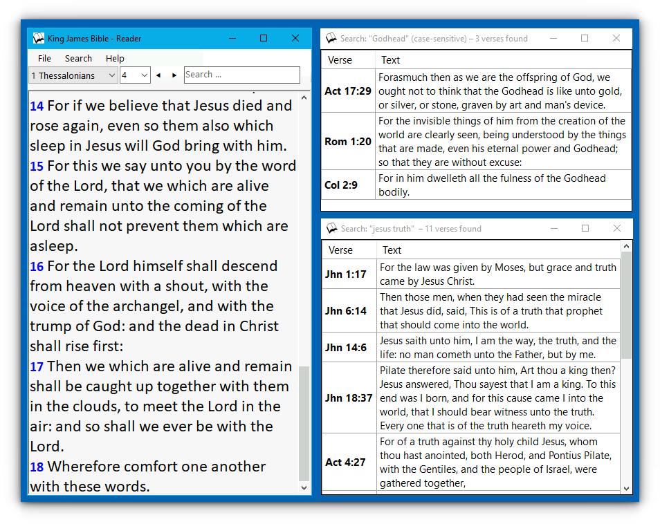

# King James Bible - Reader
A King James Bible reading application written in C# for Windows.

## Features
- KJB-only
- Quick and simple navigation
- Basic search of the Scriptures

## Screenshot

## Tips
**Navigation**
- Use <kbd>n</kbd> and <kbd>p</kbd> to quickly jump to the next/previous chapter

**Search**

Use the search box for:
1. Go to a verse in the current chapter
2. Jump to a specific book, chapter and verse. Chapter and verse are optional.
3. Search for words.

_Note 1:_ Every search in case-insensitive by default. Uppercase letters or an underscore("\_") makes it case-sensitive.

_Note 2:_ Entering "John" will jump to John 1:1. To search for the name "John" in the Scriptures add an underscore in the search string, i.e. "\_John".

## Usage
Open `KJB_Reader.sln` with Visual Studio and run the project.

## License
Public Domain
